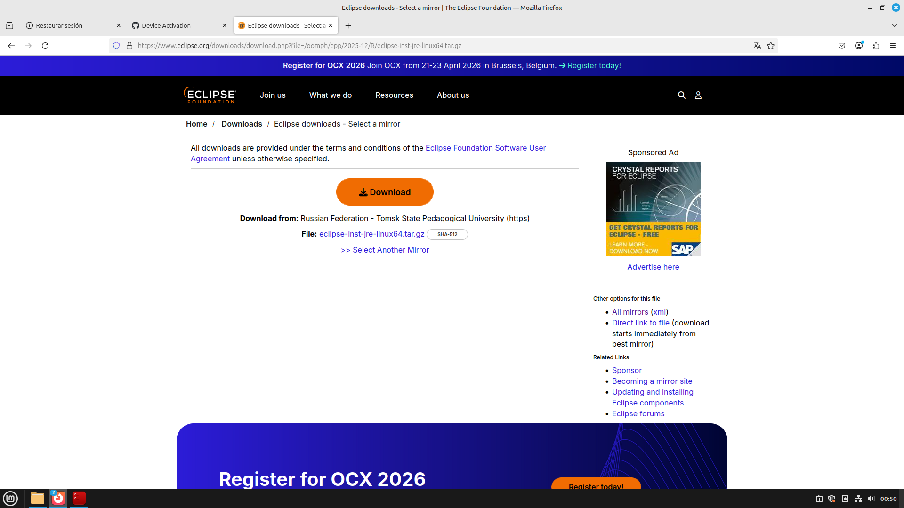
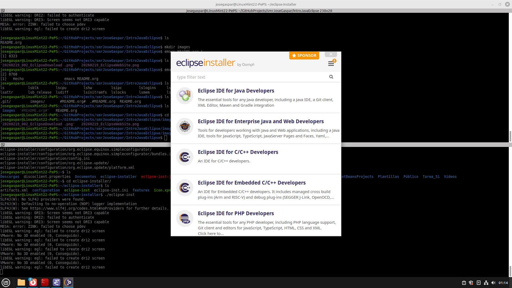
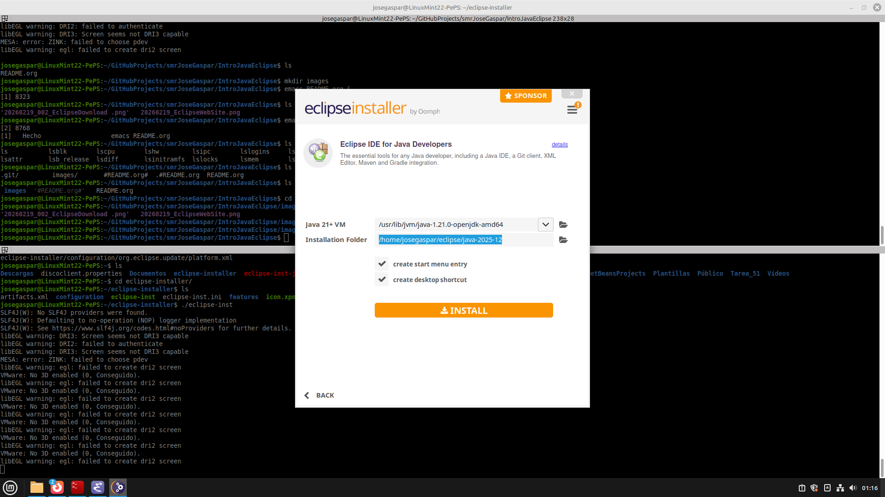
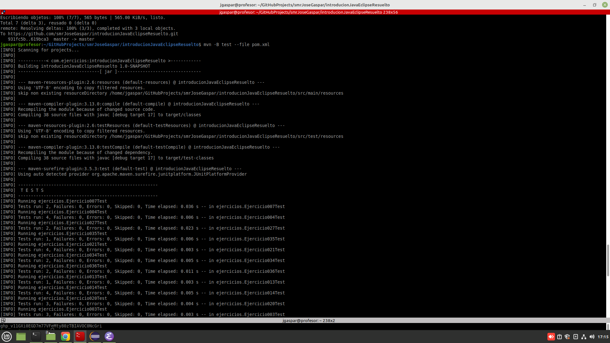
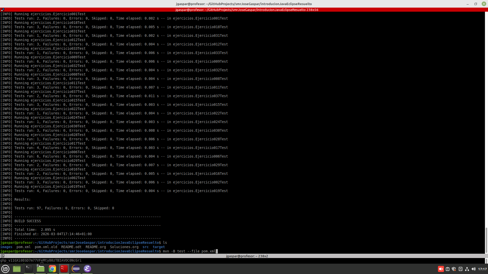
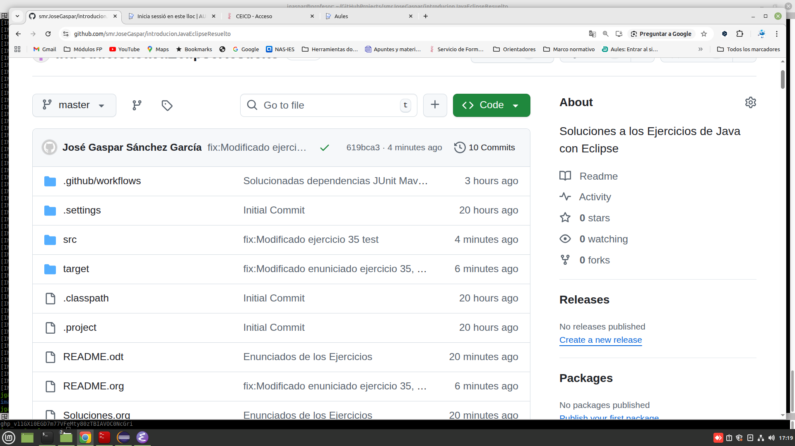
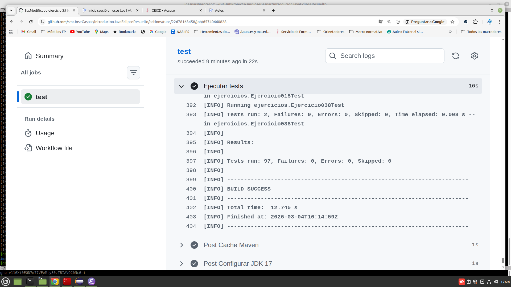

#+title: Introducción a la Programación con Java y Eclipse
#+author: José Gaspar Sánchez García
#+options: ':nil *:t -:t ::t <:t H:3 \n:nil ^:t arch:headline
#+options: author:t broken-links:nil c:nil creator:nil
#+options: d:(not "LOGBOOK") date:t e:t email:nil f:t inline:t num:t
#+options: p:nil pri:nil prop:nil stat:t tags:t tasks:t tex:t
#+options: timestamp:t title:t toc:t todo:t |:t
#+date: <2026-02-19 jue>
#+email: jg.sanchezgarcia@edu.gva.es
#+language: es
#+select_tags: export
#+exclude_tags: noexport
#+creator: Emacs 29.3 (Org mode 9.6.15)
#+cite_export:
#+HTML_LINK_HOME: index.html
#+HTML_LINK_UP: index.html
#+SETUPFILE: https://github.com/fniessen/org-html-themes/blob/master/org/theme-readtheorg.setup
#+latex_class: article
#+latex_class_options:
#+latex_header:
#+latex_header_extra:
#+description:
#+keywords:
#+subtitle: Unidad 1. Prueba de aplicaciones web y para dispositivos móviles
#+latex_footnote_command: \footnote{%s%s}
#+latex_engraved_theme:
#+latex_compiler: pdflatex

*  Descarga e instalación del Entorno de Desarrollo Integrado Eclipse
1. Descargamos el IDE Eclipse desde su página web oficial ([[https://www.eclipse.org/downloads/]]).
   #+CAPTION: Página oficial de Eclipse.
   #+ATTR_HTML: :width 800px
   
   #+CAPTION: Descarga de Eclipse.
   #+ATTR_HTML: :width 800px
   

2. Descomprimimos el archivo descargado.
   #+begin_src bash
     tar xzvf *.gz
     cd eclipse-installer
     ./eclipse-inst
   #+end_src
3. Instalamos Eclipe IDE for Java Developers.
   #+CAPTION: Instalador de Eclipse.
   #+ATTR_HTML: :width 800px
   
   #+CAPTION: Pantalla del instalador de Eclipse.
   #+ATTR_HTML: :width 800px
   
4. Creamos un nuevo proyecto Maven en Eclipse llamado /IntroJavaEclipse-INICIALES/.
  

* ¿Qué es la programación estructurada?
La programación estructurada es un paradigma que organiza el código en bloques lógicos para facilitar la lectura, el mantenimiento y la detección de errores.

Se basa en tres estructuras fundamentales:

- *Secuencia*: instrucciones que se ejecutan en orden.
- *Selección*: decisiones (if, switch).
- *Iteración*: repeticiones (for, while, do-while).

Su objetivo es evitar el uso excesivo de saltos como =goto= y promover un código más claro y modular.

* Java como lenguaje estructurado
Aunque Java es un lenguaje orientado a objetos, permite trabajar perfectamente con programación estructurada, especialmente al inicio del aprendizaje.

Características relevantes:

- Sintaxis clara y similar a C/C++.
- Tipado fuerte.
- Uso obligatorio de clases, pero el flujo del programa puede ser estructurado.
- Uso de bloques ={ }= para delimitar estructuras.

* Estructura básica de un programa en Java
#+CAPTION: Estructura básica de un programa en java
#+NAME: ejemplo001.java
#+begin_src java
public class Main {
    public static void main(String[] args) {
        // Código aquí
    }
}
#+end_src

Elementos clave:

- *class*: todo programa debe estar dentro de una clase.
- *main*: punto de entrada del programa.
- *{ }*: delimitan bloques de código.

* Variables y tipos de datos

Este ejemplo muestra distintos tipos de variables en Java y el tamaño que ocupa cada tipo primitivo según la especificación del lenguaje.
#+CAPTION: Variable y tipos de datos
#+NAME: ejemplo002.java
#+BEGIN_SRC java
    public class Ejemplo002 {

  	public static void main(String[] args) {
  	// TODO Auto-generated method stub
  		
  	// Tipos primitivos numéricos enteros
  	    byte miByte = 10;          // 1 byte  (8 bits)
  	    short miShort = 200;       // 2 bytes (16 bits)
  	    int miInt = 50000;         // 4 bytes (32 bits)
  	    long miLong = 100000L;     // 8 bytes (64 bits)

  	    // Tipos primitivos numéricos decimales
  	    float miFloat = 5.75f;     // 4 bytes (32 bits)
  	    double miDouble = 19.99;   // 8 bytes (64 bits)

  	    // Tipo primitivo carácter
  	    char miChar = 'A';         // 2 bytes (16 bits, Unicode)

  	    // Tipo primitivo booleano
  	    boolean miBoolean = true;  // No estrictamente definido

  	    // Tipo de referencia
  	    String miString = "Hola Java"; // Tamaño variable

  	    // Mostrar valores
  	    System.out.println("byte: " + miByte+". Tamaño: "+ Byte.SIZE+" bytes. Mínimo: "+Byte.MIN_VALUE+" Máximo: "+Byte.MAX_VALUE);
  	    System.out.println("short: " + miShort+". Tamaño: "+Short.SIZE+" bytes. Mínimo: "+Short.MIN_VALUE+" Máxmimo: "+Short.MAX_VALUE);
  	    System.out.println("int: " + miInt+". Tamaño: "+Integer.SIZE+" bytes. Mínimo: "+Integer.MIN_VALUE+" Máximo: "+Integer.MAX_VALUE);
  	    System.out.println("long: " + miLong+". Tamaño: "+Long.SIZE+" bytes. Mínimo: "+Long.MIN_VALUE+" Máximo: "+Long.MAX_VALUE);
  	    System.out.println("float: " + miFloat+". Tamaño: "+Float.SIZE+ "bytes. Mínimo: "+Float.MIN_VALUE+ " Máximo: "+Float.MAX_VALUE);
  	    System.out.println("double: " + miDouble+". Tamaño: "+Double.SIZE+ "bytes. "+Double.MAX_VALUE+ " Máximo: "+Double.MAX_VALUE);
  	    System.out.println("char: " + miChar+". Tamaño: "+Character.SIZE+" bytes. Mínimo: "+Character.MIN_VALUE+" Máximo: "+Character.MAX_VALUE);
  	    System.out.println("boolean: " + miBoolean+". Tamaño: 1 bit");
  	    System.out.println("String: " + miString+". Tamaño: ?");
  	}
  }
#+END_SRC

** Tabla de tamaños de tipos primitivos

| Tipo    | Tamaño   | Rango aproximado               |
|---------+----------+--------------------------------|
| byte    | 1 byte   | -128 a 127                     |
| short   | 2 bytes  | -32,768 a 32,767               |
| int     | 4 bytes  | -2,147,483,648 a 2,147,483,647 |
| long    | 8 bytes  | ±9×10^18                       |
| float   | 4 bytes  | ~6–7 dígitos decimales         |
| double  | 8 bytes  | ~15 dígitos decimales          |
| char    | 2 bytes  | Caracter Unicode               |
| boolean | N/D      | true / false                   |
| String  | Variable | Depende del contenido          |

* Entrada y salida básica

**Salida por consola:**

#+begin_src java
System.out.println("Hola mundo");
#+end_src

**Entrada con Scanner:**

#+begin_src java
import java.util.Scanner;

Scanner sc = new Scanner(System.in);
int numero = sc.nextInt();
String texto = sc.nextLine();
#+end_src

* Estructuras de control

**  Secuencia
#+begin_src java
  public class Ejemplo003 {
  	/**
  	 ,* @param args
  	 ,*/
  	public static void main(String[] args) {
  		// TODO Auto-generated method stub
  		int a = 5;
  		int b = 3;
  		int suma = a + b;
  		System.out.println("a = "+a+", b = "+b+ ", suma = "+suma);
  	}
  }
#+end_src

** Selección

*** if / else
#+begin_src java
if (edad >= 18) {
    System.out.println("Mayor de edad");
} else {
    System.out.println("Menor de edad");
}
#+end_src

***  switch
#+begin_src java
switch (dia) {
    case 1: System.out.println("Lunes"); break;
    case 2: System.out.println("Martes"); break;
    default: System.out.println("Otro día");
}
#+end_src

** Iteración

*** for
#+begin_src java
for (int i = 0; i < 5; i++) {
    System.out.println(i);
}
#+end_src

*** while
#+begin_src java
while (contador < 10) {
    contador++;
}
#+end_src

***  do-while
#+begin_src java
do {
    opcion = sc.nextInt();
} while (opcion != 0);
#+end_src

* Funciones (métodos)

#+begin_src java
public static int sumar(int a, int b) {
    return a + b;
}
#+end_src

Llamada:

#+begin_src java
int resultado = sumar(3, 4);
#+end_src

Ventajas:

- Reutilización.
- Claridad.
- Mantenimiento más sencillo.

*  Buenas prácticas en programación estructurada

- Usar nombres descriptivos.
- Evitar bloques demasiado largos.
- Comentar solo lo necesario.
- Mantener una indentación consistente.
- Dividir el código en métodos pequeños.

* Ejemplo completo

#+begin_src java
import java.util.Scanner;

public class Main {
    public static void main(String[] args) {
        Scanner sc = new Scanner(System.in);

        System.out.print("Introduce un número: ");
        int n = sc.nextInt();

        if (n % 2 == 0) {
            System.out.println("Es par");
        } else {
            System.out.println("Es impar");
        }

        System.out.println("Contando hasta " + n);
        for (int i = 1; i <= n; i++) {
            System.out.println(i);
        }
    }
}
#+end_src

* Ejercicios propuestos

*Ejercicios de Secuencia*
1. Escribe un programa que pida dos números y muestre:
   - Su suma
   - Su resta
   - Su multiplicación
   - Su división

2. Pide al usuario su nombre y edad y muestra un mensaje como:
   /"Hola Ana, tienes 20 años."/

3. Convierte grados Celsius a Fahrenheit usando la fórmula:
   F = C × 1.8 + 32

4. Calcula el área de un triángulo pidiendo base y altura.

   *Ejercicios de Selección (if / else / switch)*

5. Pide un número e indica si es positivo, negativo o cero.

6. Pide una nota (0–10) e imprime:
   - Insuficiente
   - Suficiente
   - Bien
   - Notable
   - Sobresaliente

7. Pide un número del 1 al 7 y muestra el día de la semana usando =switch=.

8. Pide un año y determina si es bisiesto.

9. Pide tres números y muestra cuál es el mayor.
   
   *Ejercicios de Bucles (for, while, do-while)*

10. Muestra los números del 1 al 100 usando:
    - un =for=
    - un =while=
    - un =do-while=

11. Pide un número y muestra su tabla de multiplicar del 1 al 10.

12. Pide números al usuario hasta que introduzca un 0. Al final, muestra la suma total.

13. Muestra los primeros 20 números pares.

14. Calcula el factorial de un número usando un =for=.

15. Pide un número N y muestra todos los números del 1 al N que sean múltiplos de 3.
    
    *Ejercicios con Métodos (Funciones)*

16. Crea un método =esPar(int n)= que devuelva =true= si el número es par.

17. Crea un método =maximo(int a, int b)= que devuelva el mayor de los dos.

18. Crea un método =saludar(String nombre)= que imprima un saludo personalizado.

19. Crea un método =potencia(int base, int exponente)= que calcule la potencia sin usar =Math.pow=.

20. Crea un método =esPrimo(int n)= que determine si un número es primo.

21. Crea un método =contarVocales(String texto)= que devuelva cuántas vocales tiene una cadena.
    
    *Ejercicios Integradores*

22. *Menú interactivo*
    Crea un programa con un menú:
    - 1. Sumar dos números
    - 2. Restar
    - 3. Multiplicar
    - 4. Dividir
    - 0. Salir

    Usa =switch= y repite el menú hasta que el usuario elija salir.

23. *Contador de vocales:*
    Pide una frase y cuenta cuántas vocales tiene.

24. *Calculadora de notas:*
    Pide 5 notas y calcula:
    - La media
    - La nota más alta
    - La nota más baja

25. *Números primos hasta N:*
    Pide un número N y muestra todos los primos desde 1 hasta N usando un método =esPrimo=.

26. *Gestor simple de usuarios:*
    Pide nombres hasta que el usuario escriba "fin".
    Luego muestra:
    - Cantidad de nombres introducidos.
    - El nombre más largo.
    - El nombre más corto.

27. Implementa un programa que convierta números decimales a binarios sin usar funciones de Java.

28. Simula un cajero automático con opciones:
    - Consultar saldo.
    - Ingresar dinero.
    - Retirar dinero.
    - Salir.

29. Genera una secuencia Fibonacci de N términos.
    
    *Ejercicios de Arrays en Java:*
30. Leer 5 números por teclado y guardarlos en un array. Luego mostrar el mayor.
31. Sumar todos los elementos de un array de enteros.
32. Contar cuántos números pares hay en un array.
33. Invertir un array (sin usar estructuras auxiliares si quieres un reto).
34. Buscar un número dentro de un array y decir si existe.
35. Calcular la media de los valores de un array de tipo *entero*.
36. Comprobar si un array es palíndromo.
37. Contar repeticiones de cada número en un array.
38. *Adivina el número:* El programa genera un número aleatorio del 1 al 50. El usuario debe adivinarlo indicando si el número introducido es mayor o menor.

* Entrega:
Debes entregar un documento PDF que contenga:
- Breve explicación de cómo has resuelto los ejercicios.
- Dirección URL del repositorio remoto GitHub donde estés ejecutando tu código.
- Captura de pantalla que muestre que los tests han sido ejecutados correctamente en local utilizando el comando =mvn -B test --file pom.xml=
   #+CAPTION: Captura de Pantalla de la Ejecución de los Tests en local.
   #+ATTR_HTML: :width 800px
  
    #+CAPTION: Captura de Pantalla de la Ejecución de los Tests en local.
   #+ATTR_HTML: :width 800px
  
- Captura de pantalla de como los test han sido ejecutados correctamente de forma remota en GitHub
   #+CAPTION: Captura de Pantalla de la Ejecución de los Tests en GitHub.
   #+ATTR_HTML: :width 800px
  
   #+CAPTION: Captura de Pantalla de la Ejecución de los Tests en GitHub.
   #+ATTR_HTML: :width 800px
     

* Enlaces de interés
- [[https://www.w3schools.com/java/java_intro.asp][W3C School - Java Introduction.]]
